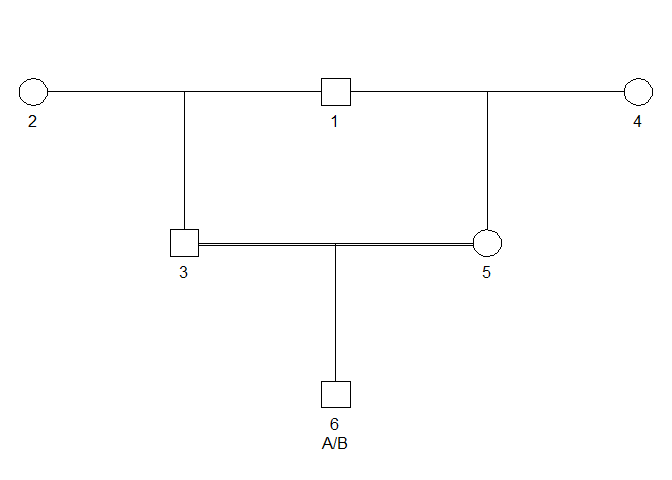

<!-- README.md is generated from README.Rmd. Please edit that file -->

# pedtools 

## Introduction

The goal of pedtools is to provide a lightweight, but comprehensive tool
set for creating, manipulating and visualizing pedigrees with or without
marker data. Common pedigree structures are quickly produced with
tailor-made functions, while a range of utilities enable modifications
like adding or removing individuals, extracting subsets, loop breaking,
and merging pedigrees. The plotting functionality is imported from the
[kinship2](https://CRAN.R-project.org/package=kinship2) package.

pedtools is a continuation of the
[paramlink](https://CRAN.R-project.org/package=paramlink) package, which
is no longer actively developed.

## Installation

To get pedtools, install from CRAN as follows:

``` r
install.packages("pedtools")
```

Alternatively, you can obtain the latest development version from
GitHub:

``` r
# install.packages("devtools") # install devtools if needed
devtools::install_github("magnusdv/pedtools")
```

## Example

We create a pedigree with a consanguineous mating between half siblings.
The child has genotype A/B at a SNP marker.

``` r
library(pedtools)

x = halfSibPed(sex1 = 1, sex2 = 2)
x = addChildren(x, father = 4, mother = 5, nch = 1)

m = marker(x, "6" = c("A", "B"))
plot(x, m, skip.empty.genotypes = TRUE)
```

<!-- -->

For details about what pedtools can do, and many other examples, the
vignette is the recommended place to start.
