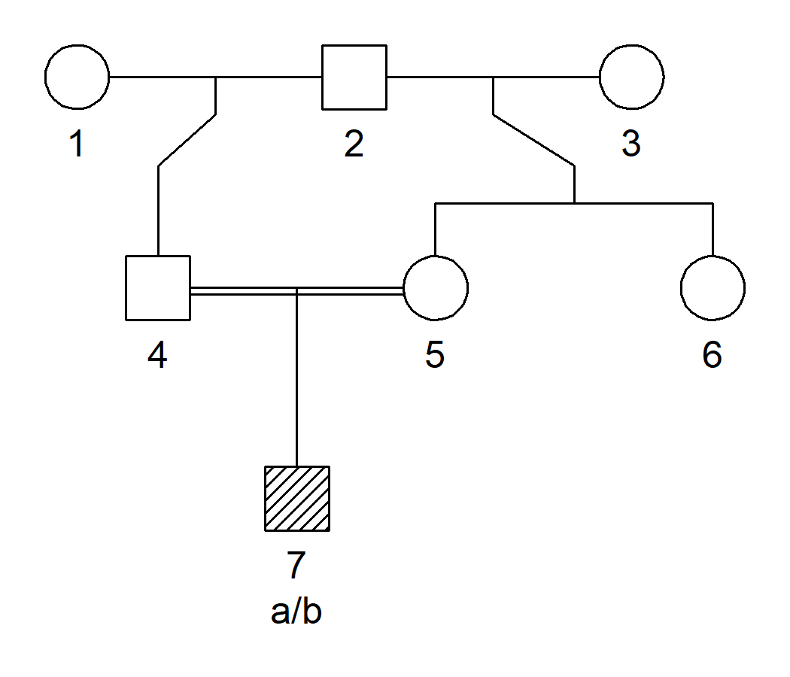

<!-- README.md is generated from README.Rmd. Please edit that file -->
pedtools
========

Introduction
------------

The goal of pedtools is to provide a lightweight, but rich tool set for creating, manipulating and visualizing pedigrees. Common pedigree structures are quickly produced with tailor-made functions, while a range of utilities enable modifications like adding or removing individuals, extracting subsets, loop breaking, and merging pedigrees. The plotting functionality is imported from the [kinship2](https://CRAN.R-project.org/package=kinship2) package.

pedtools is a rewritten and improved version of one part of the many-facetted package [paramlink](https://CRAN.R-project.org/package=paramlink), which is now heading towards retirement. The purely pedigree-related functionality of paramlink is moved to pedtools, in most cases using the same function names. Under the hood, however, many things are changed, including a new S3 class `ped` for basic pedigree objects.

Installation
------------

pedtools is under devolpment and not on CRAN yet. However, you can install the latest development version as follows:

``` r
 # First install devtools if needed
if(!require(devtools)) install.packages("devtools")

# Install pedtools from github
devtools::install_github("tidyverse/pedtools")
```

Example
-------

The following shows how to create the pedigree of an child whose parents are first cousins.

``` r
library(pedtools)

x = cousinsPed(degree=1, child=TRUE)
plot(x)
```


